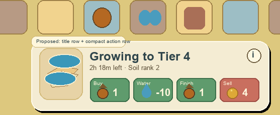

# Cell improvements (Soil · Magnet) — spec (2026-07-26)

Draft 7 — **build mode is cut; improvements arrive as seed items** (§1, §1a lists what to
revert), with the readable two-row info-bar contract and the two-beat Soil seed FTUE fix
added on 2026-07-27. Rollout step 4 of `2026-07-26-progression-systems-design.md`;
supersedes its §6 where they differ. All numbers are provisional dials — the `grove_sim`
re-pass owns finals. Acorns = `currencies.diamonds` (`save.gd:192-207`). Home board only
(Rush is a separate scene, `explore_rush.gd:65` — no flag needed).

## Summary — what is being built

Two cell improvements on the home merge board, behind a feature flag. There is **no build
mode and no board-edge button**: improvements are acquired as **seed items that drop on the
board**, and every interaction reuses the existing tap → info-bar-chip surface.

- **Seeds** drop like other special items. Tap one and its info bar offers **Place** (become
  this cell's improvement) · **Bag** · **Sell** in the readable two-row action tray (§5).
  At most one unplaced seed per kind exists at a time.
- **Soil** (max 9, 3 ranks): any eligible piece resting on it grows +1 tier on an
  offline-capable timer — 10 s at tier 1 up to 48 h for t11→t12. Pieces are never locked;
  changing one restarts the clock, with a confirm at t7+. Watering halves a step once.
- **Magnet** (max 3, rankless): a passive 3×3 field — matching pieces inside it auto-merge,
  guarded so it never eats quest-asked codes, growing pieces, or a live chain.
- A placed improvement is the cell's **background**: pieces spawn, rest, and merge on it
  normally. Tapping the cell **while it is empty** offers **Unsocket**, which pays a cost and
  turns it back into a seed — that is also how you move one.
- Around them: an FTUE seed grant at ~L6, save state riding the board dict, a test suite, and
  a `grove_sim` re-pass. Mocks: `games/grove/assets/_concepts/ui/improvements_v1/` plus the
  follow-up info-bar target `docs/superpowers/specs/2026-07-27-info-bar-redesign-v1.png`.

## 1 · Seeds — acquisition, placement, unsocket

**The seed item.** Soil and Magnet each get a pseudo-line in `SPECIAL_ITEMS`
(`grove_data.gd:449`) — lines **29** (soil seed) and **30** (magnet seed), both `"top": 1`
so they never merge. They are ordinary board occupants otherwise: draggable, stashable in the
bag, sellable, and they occupy a cell. The line numbers must stay clear of scissors (14),
live content lines, and legacy save rosters; reusing a retired content line would resurrect
old pruned saves as seeds.

**Dropping.** Seeds join the existing special-drop table
(`SPECIAL_DROP_WEIGHTS`, `grove_data.gd:462`) and ride the roll that already happens after a
merge — `pick_special_drop` makes exactly **one** `randi_range` call
(`content.gd:1477-1491`), and adding kinds must not add a second. Weight the seeds low
(§6). A kind is **filtered out of the weight table before the draw** when either:

- an unplaced seed of that kind already exists on the board **or** in the bag, or
- that kind is at its placed cap (9 Soil / 3 Magnets).

The filter is a pure function of board + bag state, so the draw count is unchanged and the
stream stays deterministic. When filtering empties the table, the drop resolves to the
ordinary special-item pick as it does today. Per-kind gating means one soil seed and one
magnet seed may be in flight at once.

**Placing.** Tap a seed → the info bar shows its name and three chips
(`ActionBar.action_chip`, the pattern at `board.gd:2118-2124`):

- **Place** — the seed is consumed and the cell it sits on becomes that improvement. Legal
  only where `can_build_improvement()` already allows (unsealed, no generator, not already
  improved); the seed's own occupancy does not count against "empty". Free.
- **Bag** — stashes the seed through the existing `_stash` path.
- **Sell** — the existing trashcan chip, at the §6 dial price.

Placing from the **bag** is not a separate flow: drag the seed back onto a cell, then tap and
Place. There is no chooser modal, no pads, and no build mode.

**Unsocket (and how you move one).** Tapping an improved cell **that has no piece on it**
selects it and offers one chip, **Unsocket**: pay the §6 cost, and the improvement becomes a
seed item on that same cell. Soil rank travels with the seed. Moving is unsocket → carry →
Place, so there is no separate move verb and no pending-move state. An improved cell holding
a piece selects that piece as normal — the improvement is background.

### 1a · What to revert from draft 5's implementation

The shipped branch built a build mode. Remove it entirely:

- `board.gd` — the leaf button (`build_btn`, `_refresh_build_button`, its `_ready` wiring),
  `_build_mode`, `_start_build_mode`, `_exit_build_mode`, `_render_build_pads`,
  `_clear_build_pads`, `_improvement_pad_nodes`, `_make_improvement_pad`,
  `_on_improvement_pad_pressed`, `_open_improvement_sheet`, `_improvement_move_from`,
  `_move_improvement_from`, `_move_improvement_from_confirmed`, `_finish_improvement_move`.
- `_open_improvement_cell` — keep the cell-tap entry point but replace the modal sheet with
  the info-bar Unsocket chip; Soil rank-up moves onto the same info bar.
- `BoardActions.build_improvement` / `move_improvement` → replace with
  `place_seed(board, cell)` and `unsocket_improvement(board, cell)`.
- Dials `SOIL_BUILD_PRICES`, `MAGNET_BUILD_PRICES`, `IMPROVEMENT_MOVE_COST` and their
  `content.gd` re-exports.
- The FTUE beat's `_start_build_mode()` call (`board.gd:2578`) → grant a seed instead (§5).
- `games/grove/assets/ui/kit/build_leaf.png` (+ `.import`) — delete, the button is gone.
- Tests naming build mode / pads / the move flow.

**Keep unchanged:** everything in §2–§4 (the model, the laws, soil growth and its curve,
ranks, water, the t7+ warning, the magnet field and its five guards), the save shape,
`cell_soil.png` / `cell_magnet.png` / `pip_leaf.png`, and every regression test from the
review round (the dead-fall-through, RNG byte-identity, mark-seen catch-up, and drag-node
tests are all still load-bearing).

## 2 · Model & laws

`BoardModel.improvements: Dictionary` — cell → `{kind, rank, code, ends_at, watered}`, the
`gens` trio shape (`board_model.gd:13-24`). Serialized as flattened
`[[row, col, kind, rank, code, ends_at, watered], …]` inside `to_dict()`/`from_dict()`
(`board_model.gd:493-557`), tolerant parse, rides `g["board"]` — no new `_persist()` key,
no `SCHEMA_VERSION` bump (a bump wipes saves, `save.gd:49-58`).

Laws (each tested, §9):

1. Piece truth stays in `board.items[cell]`; improvement rows never copy a piece.
2. Pieces are never locked; the Soil clock reacts to changes instead (§3).
3. Improved cells are ordinary ground — spawns and drops land on them; on Soil, any arrival
   starts growing. Exception: generator auto-placement (`seed_gens`, self-dup
   `board.gd:3076`, birth-on-tap) skips improved cells. Manual gen drops allowed.
4. No randomness, ever (the RNG stream is persisted and order-sensitive, `board.gd:983`).
   All ordering, timing, and selection below is deterministic; auto-merges roll no drops.
5. No path calls `G.earn_coins`/`Save.earn_coins` (sim invariant Y, `save.gd:118-124`).
6. Beats: Soil reconcile + Magnet scan in `_after_board_change()` (`board.gd:1011`);
   countdown display on the 1 Hz board Timer (`board.gd:362-366`); completion authority is
   the `ends_at` unix stamp, checked on tick and in `_load_state` (offline-inclusive, the
   `regen_ts` pattern `board_logic.gd:13-20`).

Pure rules in `engine/scripts/core/improvements.gd` (`resident_bucket.gd` shape: statics,
time injected). Dials in `grove_data.gd`, read through `content.gd`. All behind
`Features.on("improvements")`.

## 3 · Soil

- Any eligible piece resting on Soil is growing, however it arrived. No plant verb, no
  cancel verb.
- Eligible: tiered line piece below `G.merge_top(code)` (`content.gd:1390`; specials cap
  t3). Not coins (line 9), chests (10), collectables (12/13), generators. Ineligible sits,
  no ring.
- Reconcile each `_after_board_change()`: same code → clock runs; new eligible occupant →
  fresh clock, `watered` cleared; empty or ineligible → activity cleared.
- Completion at `ends_at`: +1 tier in place (rank 3: +2), clamped to `merge_top`; land
  bounce (`board.gd:3049-3067` trio); fresh clock starts at the new tier.
- Curve — time per step, by the tier grown **from**:

| From | 1 | 2 | 3 | 4 | 5 | 6 | 7 | 8 | 9 | 10 | 11 |
|---|---|---|---|---|---|---|---|---|---|---|---|
| Time | 10 s | 45 s | 3 min | 15 min | 30 min | 1 h | 4 h | 8 h | 16 h | 24 h | 48 h |

- Ranks: r2 times −30% · r3 +2 tiers per completion.
- No ask interplay — growth ignores the fence.
- Selecting a growing piece → info-bar grow row: *"Growing to t8 — 2h 18m"*
  (`residents.gd:648` format) + one chip (`ActionBar.action_chip`, pattern
  `board.gd:2118-2124`):
  - **💧 −10** — spend `SOIL_WATER_COST := 10` board water, once per step: remaining time
    halves. Via the scene `water` field + `_update_water_hud`, then `_after_board_change()`.
  - There is no acorn "finish now" action: growth is only ever shortened by Water.
- On the piece: thin progress ring (1 Hz); a countdown chip ("2h") when the step ≥ 15 min.
- **t7+ warning:** any player action that resets or consumes a piece growing from tier ≥ 7 —
  move, merge, deliver, sell, stash — first shows a confirm (`Overlay.modal`, dismissable):
  *"This restarts 6h of growing. Move it anyway?"* — Keep growing (default) / Move it.
  Nothing below t7. No automatic path needs it (Magnets skip growing pieces).
- Weather seam (dormant): module exposes `apply_water(activity, now)`; the 💧 chip pays and
  calls it; Rain (step 5) calls it free per `2026-07-26-weather-hours-design.md` §4.

## 4 · Magnet

- **No ranks — one range: the full 3×3 from the moment it is placed.** Off-board and sealed
  cells are not in range. Shown as a faint field while the Magnet cell is selected.
- The Magnet's own cell is ordinary ground: pieces may be placed on it, spawn there, or rest
  there; a piece on the Magnet cell is inside the range and auto-merges like any other (a
  pair including it lands on the Magnet cell — it is the nearest cell).
- When two same-code `can_merge` pieces (`board_model.gd:305-311`) sit inside one Magnet's
  range, they auto-merge: both slide to the pair cell nearer the Magnet (tie → lower board
  index, `board_model.gd:37`), then standard merge FX at reduced scale (`GridFx.play_merge`
  dialog-muted, `grid_fx.gd:27`).
- Cadence: scan in `_after_board_change()`; one merge per ~0.3 s, model-committed before its
  FX (per-merge `animating` stays under the 0.6 s watchdog, `board.gd:412-419`); loops until
  no pair remains. Order: lowest tier, then board index. Overlapping ranges: each Magnet
  scans independently, in board-index order; a pair must fit inside a single Magnet's range.
- Guards (each tested):
  - never a quest-asked code — `_asked_codes` (`board.gd:1512-1518`) lifted into a
    `quests.gd` static (step-2 mastery's `ask_band` derives from the same primitive);
  - never a piece growing on Soil;
  - hold fire while a chain is armed — the scene's `chain_armed_cell()` seam (cascade spec
    §4); resume on the next fan-out;
  - no combo bump, no coin/special drop rolls, no chain credit; bramble opening
    (`openable_brambles`) and the fan-out refreshes still fire;
  - kind-uniform otherwise: coins, chests, specials auto-merge like anything (cascade R5).
- Pair scan: new `board_logic.gd` static `range_pairs(board, cells: Array) -> Array` of
  `[cell_a, cell_b]`. Validate against a known-positive and a known-negative fixture.

## 5 · UI & FTUE

Everything runs on the existing select → info-bar-chip surface. No modals, no pads, no
board-edge button, no new screen.

**Info-bar readability target.** The current one-row tray is too cramped once a selected item
has three or four verbs: the item name collapses into unreadable word fragments. Replace the
single-line layout with an adaptive **two-row center tray** at phone widths. The selected item
art stays in a fixed left well; the title and subtitle get the full top row; all visible verbs
sit in a stable lower action row. Mock target:

The mock is drawn 557 px wide; the game renders 1080×1920, so every size below is a
**fraction of the tray's inner width**, not a mock pixel count (the `width_pct` pattern
already used elsewhere in the kit).

- The title row is never narrower than **40 %** of the tray's inner width (220/557 in the
  mock); names use one line with ellipsis only after the whole word boundary fails.
  Descriptions are one line, clipped with ellipsis, not multi-line wrap.
- The action row uses fixed compact chips, **10–14 %** of the tray's inner width each
  (56–80/557 in the mock), with
  icon + count/price as the primary read. Visible captions are short and must fit without
  wrapping: **Place**, **Bag**, **Buy**, **Water**, **Sell**, **Rank**,
  **Unsocket**. Every chip also carries `tooltip_text` / accessibility text with the full
  action name and price.
- Three-piece bottom composition stays unchanged: Home tile · cream info tray · Bag tile.
  Only the interior of the center tray changes. The tray may grow within `BOTTOM_BAR_MAX`,
  but it must not cover the board or push Home/Bag off-screen.
- When fewer than three action chips are visible on a wide layout, the existing single-row
  arrangement may remain if the title row still meets the minimum width; otherwise use the
  two-row tray.

- **Seed selected:** info bar shows the seed's name and one-line description in the title
  row, plus action-row chips **Place** (garden-green, primary) · **Bag** · the existing
  **Sell** trashcan. `Place` is disabled-with-wobble on an illegal cell (sealed, generator,
  already improved) with the reason in the subtitle. Placing plays `FX.pop` on the new cell
  art.
- **Improved cell, empty, selected:** info bar shows *"Soil · rank 2"* or *"Magnet"* in the
  title row plus **Unsocket** carrying its price (coin or acorn icon), and for Soil the next
  rank's price on the same action row (`FX.celebrate_at` on rank-up, no modal).
  Direct-spend, no nested confirm — the `board.gd:4738` `_activate_gen_boost` pattern; unaffordable wobbles
  the wallet.
- **Improved cell holding a piece:** selects the piece exactly as today; the improvement is
  background. The grow row (below) replaces the chips while it is growing.
- **FTUE (~L6):** arms at level ≥ 6, `ftue_seen("soil")` (`save.gd:343-352`); calm-moment
  deferred beat (retirement-offer template `board.gd:3938-3964`, gated on
  `board_tutorial_seen`). It **grants a soil seed** onto a free cell, or into the bag when
  the board is full (deterministic, not rolled), with a one-line card — *"A seed of good
  earth! Tap it to choose a spot."* — then `HandHint.present` (`hand_hint.gd:53-71`) points
  at the seed when it is visible on the board. If the board and bag both have no destination,
  it stays unmarked so the next room-making moment can grant the seed. The player taps it and
  presses Place. Seeds begin dropping normally from then on.
- **FTUE tracking/re-targeting:** `_maybe_hand_hint()` is still called from `_rebuild_all()`,
  and must also run from `_after_board_change()` after the board-dependent refreshes. That
  fan-out is the real post-mutation contract, so moving, swapping, stashing, bag retrieval,
  delivery, and seed placement all retarget or dismiss the teach without requiring a full
  rebuild. Seed-cell cutouts come from board cell geometry (`_cell_pos(cell)` + `csz`) rather
  than the live piece node's rect, so a slide tween cannot freeze the hole at an in-flight
  position.
- **FTUE beat 1 — `soil_seed`:** eligible when `soil` is seen, `soil_seed` is not seen, and a
  Soil seed is visible on the board. Tap gesture, cutout = that seed's board cell. Tapping the
  seed selects it but does **not** mark the lesson complete.
- **FTUE beat 2 — `soil_place`:** eligible when `soil` is seen, `soil_seed` is not seen, the
  selected cell holds the Soil seed, and the Place chip is visible. Tap gesture, hand target =
  the Place chip; cutouts = the seed cell plus the Place chip, so the info bar is never dimmed
  under its own teach veil. This is a transient hint id; the persisted completion key remains
  `soil_seed`.
- **FTUE completion:** pressing **Place** on a Soil seed marks `soil_seed` seen and dismisses
  any active `soil_seed` / `soil_place` hint. Pressing **Sell** also marks `soil_seed` seen,
  because the seed is gone. Pressing **Bag** only dismisses the current overlay; it must not
  write the ledger, so pulling the seed back onto the board teaches again.
- Visuals (normative for mocks and implementation; palette roles per the art guide §3):
  - Soil seed item: a small burlap seed pouch, gold-brown, sprig of green at the neck.
  - Magnet seed item: a slate-blue horseshoe nub half-buried in a paper seed husk.
  - Soil cell: rounded matte earth patch, desaturated gold-brown, deckled cut-paper edge, one
    same-hue shadow plane.
  - Magnet cell: horseshoe pebble in structural slate, inset on the cell.
  - Soil rank pips: 1–3 garden-green leaf pips, bottom-left corner of the cell. Magnet has
    no pips.
  - Growing piece: thin garden-green progress ring, clockwise; small warm-cream time chip
    with ink text ("2h") at the piece's top-right when the step ≥ 15 min; sprout wiggle.
  - Magnet range field: translucent garden-green cut-paper field (~15% opacity) over the
    range cells, under the pieces.
  - Grow row: info tray title *"Growing to Tier 8"*; subtitle *"2h 18m left · Soil rank 2"*;
    action-row chip 💧 droplet **−10** plus the ordinary Buy/Sell chips when the piece is
    sellable/buyable — three chips at most.
  - Warning card: *"This restarts 6h of growing. Move it anyway?"* — **Keep growing**
    (action green, default) · **Move it** (quiet cream).
- Raster masters (already produced; 512² transparent, at `games/grove/assets/ui/kit/`):
  `cell_soil.png` · `cell_magnet.png` · `pip_leaf.png` · **`seed_soil.png`** ·
  **`seed_magnet.png`**. `build_leaf.png` is deleted with the button (§1a). Everything else
  — ring, time chip, range field, chips — is code-drawn. **Generate no production art**:
  wire these paths; if one is missing use an existing kit icon behind the same seam.
- Mocks: `games/grove/assets/_concepts/ui/improvements_v1/` — the soil-growing and
  magnet-range mocks still hold for board art. The build-mode and build-sheet mocks are
  **stale**; ignore them (kept only as history). For the crowded bottom tray, use
  `docs/superpowers/specs/2026-07-27-info-bar-redesign-v1.png` as the composition target.

## 6 · Dials (provisional)

| Dial | Value |
|---|---|
| Seeds | drop free; `SPECIAL_DROP_WEIGHTS` soil **1**, magnet **1** against chest/water/acorn 1 each |
| Caps | 9 Soil · 3 Magnets (placed + unplaced count toward the drop gate) |
| Place | free |
| **Unsocket** | Soil **100 coins** · Magnet **10 acorns** |
| Seed sell price | Soil seed **250 coins** · Magnet seed **1 000 coins** |
| Soil ranks | r2 600 · r3 1 500 coins |
| `SOIL_WATER_COST` | 10 water — sim revisits the flat halve at t10+ (worth 24 h at t11) |

Consts in `grove_data.gd` beside `BOOST_COST` (`grove_data.gd:232`); nothing in
`economy_tuning.json` unless the owner wants a live dial.

**Economy note (owner decision, flagged for veto).** Free seeds delete the build-price
ladder, which was the standing coin sink and the *only* premium sink — the last sim run
showed `improvements 5600🪙` and `magnets 175💎`. To keep both alive the cost moves to the
verb the Dev specified: **unsocketting costs coins for Soil and acorns for Magnet**. Soil
rank-ups (up to 9 × 2 100 coins) carry the coin sink. If you would rather magnets stay
purely free-to-earn, say so and the acorn sink drops to zero — the sim re-pass will show it.

## 7 · Sim re-pass (gates the merge)

Run: `godot --headless --path . -s res://games/grove/tools/grove_sim.gd -- [days] [seed]`.

- coin spends (Soil ranks + Soil unsockets) into a new `improve_spend` counter folded into
  `coin_sink` (`grove_sim.gd:337`) and the Z report (`:341`); Magnet unsocket acorns into the
  D diamond ledger. The bot places every seed it earns and ranks up greedily → I3 runway.
- **Seed supply:** model the drop gate (one unplaced seed per kind, caps 9/3) and report how
  many days it takes to reach the caps — free seeds mean the build ladder no longer paces
  adoption, so the drop weight is now the pacing dial.
- I1 zero jams at full build-out (12 improved cells).
- Soil as a bounded faucet — 9 cells on the §3 curve to t12; re-confirm Y and faucet drift;
  price the t10+ watering halve.
- Magnet is value-neutral (merges only what exists); assert no ledger moves beyond normal
  merge accounting.

## 8 · Persistence

- Rows ride `g["board"]`; defaulted on read; cloud save unchanged.
- Tolerant load: invalid-cell rows dropped; activity reconciled against `items[cell]` as on
  any board change (covers `_purge_above_level_content`, `board.gd:774-822`).
- Store `ends_at` stamps, never remaining-seconds.

## 9 · Tests

Maintain `games/grove/tests/grove_improvements_tests.gd` on `grove_test_base.gd` (pure
rules + real-scene via manual `_ready`, `grove_improvements_tests.gd:47-52`, and `_tap_board`
`grove_test_base.gd:153`) and the `range_pairs` units in `engine/tests/`. The suite is already registered
in `GROVE_TESTS`; new regressions belong there unless a lower-level engine unit test can pin
the behavior more directly.

Cover: **seed drop gate** — no second seed of a kind while one is unplaced on board or in
bag, none at cap, and the filtered pick makes exactly ONE rng draw (assert `rng.state`
advances by the same amount as an unfiltered drop) · seed Place/Bag/Sell chips incl. illegal
-cell refusal · **unsocket** — cost charged, seed returned to that cell, Soil rank travels,
refused while a piece rests there · a placed improvement is background (pieces spawn/rest/
merge on it) · spawn on Soil grows; gen auto-place skips · clock reconcile matrix
(arrive/leave/replace/merge-onto/complete; `watered` per step) · curve incl. ranks and
`merge_top` clamps · water-once, and a growing piece's action row carrying exactly Buy/Water/
Sell with no finish chip · offline completion via stamp · t7+ warning
on every reset path, absent below t7 · magnet 3×3 from placement; a piece on the Magnet cell
auto-merges · auto-merge order, landing cell, loop-until-done · all five guards (asked code
· growing piece · armed chain · no credit/no RNG, `rng.state` byte-identical ·
kind-uniformity) · save round-trip, tolerant load, purge self-heal · `range_pairs`
known-positive/negative · FTUE grants exactly one seed, once · Soil-seed hand retargets
after move/swap/stash/bag retrieval without a full rebuild · selecting the seed advances to a
Place-chip teach whose veil leaves both seed cell and Place chip undimmed · bagging the seed
does not mark `soil_seed` seen, while Place and Sell do.

**Carry forward unchanged** — the regression tests added in the draft-5 review round stay
and must keep passing: `_stash` / `_deliver_from_board` fall-through, giver-tap t7 confirm,
magnet-bramble `rng.state` identity, `_mark_seen` catch-up, top-soil info refresh, and the
tick-does-not-free-the-drag-node test. Add a UI geometry assertion for the compact info bar,
measured on the real built node tree at the shipped 1080×1920 viewport with a growing Soil
cell selected: the title Label reports a single line (no wrap), every action caption fits its
chip without truncation, and the title row holds at least 40 % of the tray's inner width.

## 10 · Implementation directions (for the implementing agent)

**This is follow-up work on the seed implementation now present on `main`.** Create a fresh
review worktree from the current repo state; do not edit the main checkout directly. Keep
§2–§4 and every existing regression test.

Read before coding: this spec end to end; `docs/design/board_decomposition.md` (layering
`scenes/ → ui/ → core/`, frozen `_persist()` key set, RNG discipline); the §2 anchors in
their files.

Two independent tasks. **A does not depend on B — do A first**, it is the one a live player
hits. Anchors below verified at `e268416a`; re-grep before trusting a line number.

### Task A — the Soil-seed FTUE (three defects, all reproduced)

Reproduce first, at L6 with `ftue_seen = {merge, gen_tap}`: the board grants a Soil seed and
the hand teach lights its cell.

**A1 · the hint does not follow the seed.** `_maybe_hand_hint()` (`board.gd:910`) is called
only from `_end_hand_hint` (`:1017`), the end of `_rebuild_all` (`:2264`) and
`_maybe_soil_ftue` (`:2774`, `:2781`). A plain move does not rebuild — `_commit_move_confirmed`
reparents the node and calls `_after_board_change()`, which rebuilds only when an improvement
changed. Measured: seed (3,3)→(5,3), cutout stayed at the old rect. Swap, stash and bag
retrieval have the same hole.
**Fix:** also call `_maybe_hand_hint()` from `_after_board_change()` (`:1357`) — the file's
own documented post-mutation fan-out — keeping the `_rebuild_all` call. It must stay
idempotent: `_after_board_change` itself calls `_rebuild_all` on some paths, so two calls can
be in flight in one frame. Both `await get_tree().process_frame` first, then either retarget
(same id) or dismiss, and `HandHint.present` frees a stale node — verify that holds rather
than assuming it. Early-out before the `await` when the flag is off or the ledger is complete;
this runs on every board mutation.
**Also:** build the seed cutout from cell geometry (`_cell_pos(cell)`, `csz`), not the piece
node's rect (`_hand_hint_rects` `:969` → `_local_rect` via `_soil_seed_hint_cell` `:944`).
`_commit_move_confirmed` tweens the node with `GridFx.slide_and_land`; a node-rect cutout
freezes mid-slide.

**A2 · the tap's result is hidden under the teach's own veil.** Tapping the seed selects it
and reveals the Place chip (`_select_item` `:3269` → `_refresh_seed_chips` `:3199`), but the
veil is *screen minus the cutouts* and the only cutout is the seed cell. Measured: the Place
chip renders at `(62, 101, 71)` over 12 145 px — exactly `LEAF #5F9B6D × 0.65`, the palette
green under `DIM_ALPHA` 0.35. The hand keeps bobbing because the teach only ends on
place/bag/sell. The player reads this as "the tap did nothing".
**Fix:** add the transient `soil_place` beat per §5. It needs a TAP hint that keeps a second
context cutout — today `HandHint.cutouts()` (`hand_hint.gd:93`) returns both rects for a drag
and only `_dst` for a tap. Widen it so a tap also exposes `_src` when `_src` is non-empty;
keep `Rect2()` meaning "no context cutout" so the merge/gen_tap teaches are untouched. Hand
target = the Place chip, context cutout = the seed cell.

**A3 · bagging burns the teach.** `_stash_confirmed` (`:5342`) calls
`_end_hand_hint("soil_seed")`, which writes the ledger, so pulling the seed back out teaches
nothing. Measured: `after stash: seen(soil_seed)=true, seed_in_bag=true`.
**Fix:** dismiss without writing the ledger. Place (`:2581`) and Sell (`:5812`) keep the
write — placed is taught, sold is gone.

Tests (grove_improvements_tests.gd), each failing before the fix:
move the seed → the cutout covers its new cell; tap the seed → the id becomes `soil_place`
and a cutout covers the Place chip; bag the seed → `ftue_seen("soil_seed")` is false and the
teach returns on pull-back. Drive both halves of every round trip through their real entry
points (`_stash` → `_retrieve_from_bag`, not `board.place`) — a probe that shortcuts one half
invents defects as readily as it hides them.

Add a permanent `grove_shot` mode for this state (level 6, `ftue_seen = {merge, gen_tap}`) so
the teach is capturable; the fix is not done until its frames have been looked at.

### Task B — the two-row info bar

Independent of A. Add the adaptive two-row/compact-chip mode to the shared seam
(`action_bar.action_chip` `action_bar.gd:272`, `games/grove/ui_kit.gd`) and drive it from
`_build_info_bar` (`board.gd:3066`) — no bespoke per-chip layout. Every chip type already
goes through `_set_action_chip`; keep it that way. Sizes are fractions of the tray's inner
width (§5), never mock pixels. Update the UI workbench preview knobs if the widths become
tunable. Current failure to fix, visible on any growing Soil cell: the title wraps to two
lines and the subtitle is clipped by the tray's bottom edge.

Hard rules (violations fail review): never bump `SCHEMA_VERSION`; zero RNG draws in any
improvement path (the byte-identity test pins it); never call `G.earn_coins`/
`Save.earn_coins`; reuse the named shared components — no bespoke modals, chips, cells, or
keyers; all dials in `grove_data.gd`, none inline.

**Assets — do not generate any.** The five raster masters (§5) already exist at
`games/grove/assets/ui/kit/`: `cell_soil.png`, `cell_magnet.png`, `pip_leaf.png`,
`seed_soil.png`, `seed_magnet.png`. Do not generate, draw, edit, or download art of any
kind. Wire the exact paths; if a master is missing, put a placeholder behind the same seam —
an existing kit icon or a flat tinted rect — so the real file swaps in with zero code
change. Everything else is code-drawn per §5. `build_leaf.png` is deleted with the button
(§1a). When a master is first drawn in a top-level dialog, add its bake target per the art
guide §8 (`make bake-textures`).

Process: run `make test-fast` after every change and the full `make test` before handing
off — always in the **foreground** (a backgrounded run never returns to an agent). A plain
`godot -s` foreground run times out at 2 min — parse-check with
`godot --headless --check-only --script <file>` and run suites only via `make`. After adding
any new `.gd`, run `make import` before committing so its `.uid` lands in the same commit.
Capture proof of the new surfaces (`make shot-grove OUT=…` from the worktree) and list the
capture paths in the handoff note.

**This section can be wrong — it outranks itself.** The anchors and the fixes above are one
reading of the code. If an anchor has moved, or a described defect no longer reproduces at
HEAD, or a prescribed fix would change behaviour nobody asked to change, **do not force it**:
leave that part, and say so in the handoff. A correct refusal is a deliverable. Reproduce
each defect at HEAD before fixing it — this repo auto-commits `main` and peer agents merge
into it mid-session, so a report naming exact lines can be stale by the time it is read.

Done = full `make test` green in the worktree, captures listed and actually looked at,
"what I left and why" stated, branch left unmerged for review.

## 11 · Open questions

1. t5 grow step = 30 min — interpolated between the pinned 15 min and 1 h.
