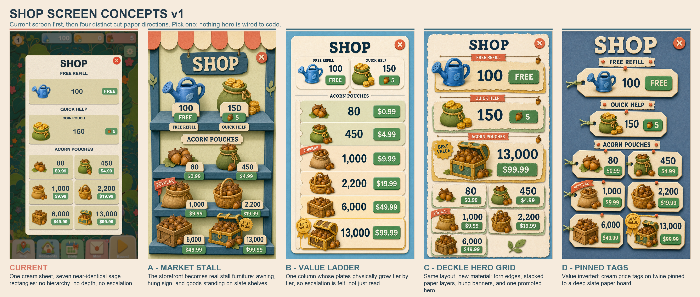
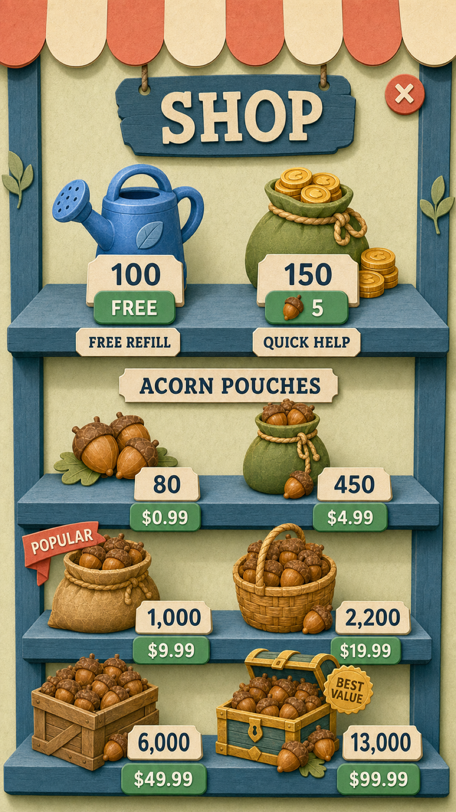
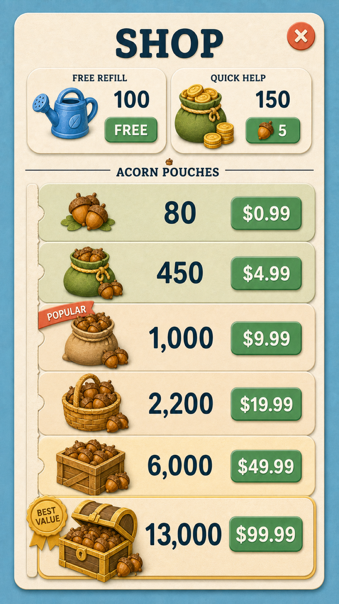
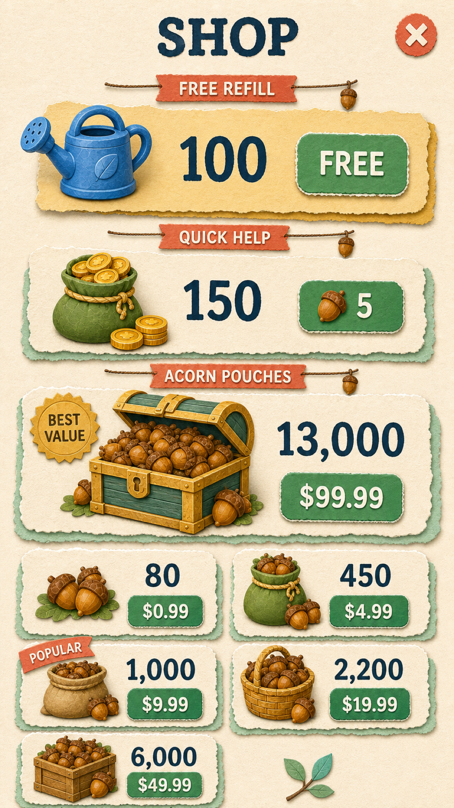
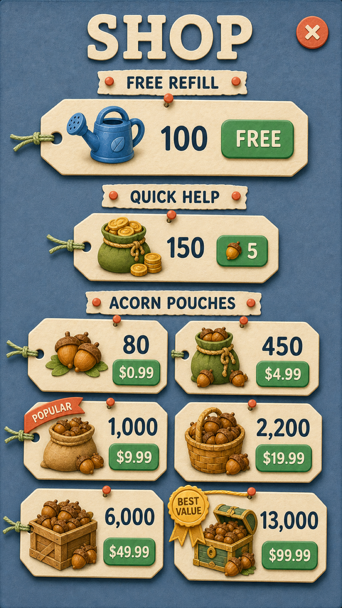

# Shop Screen Variations v1

Four deliberately different Meadow Sky + Cut-Paper directions for the SHOP screen, all
generated at `1080x1920` for iPhone review. Every mock carries the identical offer set —
the same free refill, the same quick-help pouch, the same six real-money acorn tiers with
the same amounts and prices. Only the organisation, the material, and the hierarchy change.

These are concept images, not runtime assets. Nothing in this folder is wired into
`shop.gd`, `ui_kit.gd`, or any shipped texture.

## Why these exist

The shipped shop moved its offer cards off three baked nine-patch PNGs onto the shared
code-drawn cut-paper panel. That was the right architectural move — the cards now inherit
the game's material automatically — but it flattened the screen. The baked art carried
per-card painted detail a uniform drawn sheet does not, and the whole UI lost its torn
deckle edge in favour of a smooth antialiased cut at the same time. The result is one cream
sheet holding seven near-identical sage rectangles: no focal hierarchy, no sense of the six
tiers escalating, no depth layering, no ornament, and section headings that are only small
centred words.

Baseline capture: `shop_current_baseline_1080x1920.png` (from `make shot-map MODE=shop`).

## Compare them in one image

`shop_screen_variations_v1_comparison.png` — current screen first, then A, B, C, D, each
labelled with its name and its one-line idea.

## A — Market Stall

- Deletes the offer card entirely. The storefront becomes real stall furniture: a scalloped
  coral-and-cream awning, the title cut into a slate signboard hung on two cords, and four
  slate plank shelves against a pale-meadow back wall.
- The goods **stand on** the shelves and overhang the lip. Each amount is a small cream price
  tag propped at the container's base; each `$` price is a green paper button pinned to the
  shelf lip beneath it. Section words are plaques fixed to the shelf fronts.
- Strongest advantage: the only direction that reads as a *place* rather than a list. It also
  gives the two soft-currency offers a natural home (the counter) without a section header
  competing with the paid tiers.
- Trade-off: shelf furniture is fixed structure, so the layout is the least flexible if an
  offer is ever added or removed. The counter row is also the busiest area on the screen.
- Files: `shop_screen_a_market_stall.png`, `shop_screen_a_market_stall.prompt.txt`.

## B — Value Ladder

- Abandons the two-column grid. The six paid tiers become one column whose plates grow
  taller tier by tier, so the escalation is felt in the size of the paper rather than read
  off the numerals. A notched cut-paper spine down the left margin widens with each rung.
- The two soft-currency offers compress into a single quiet pill row under the title, so the
  paid ladder owns roughly two thirds of the screen. Tier 6 is a gold-rimmed hero plate.
- Strongest advantage: the clearest possible expression of "these tiers escalate", and the
  single column is the most forgiving layout on narrow phones.
- Trade-off: one column costs vertical room, so the screen must scroll or the top tiers must
  stay slim. It also gives the cheapest tier the least visual weight, which is a pricing
  decision as much as a design one.
- Files: `shop_screen_b_value_ladder.png`, `shop_screen_b_value_ladder.prompt.txt`.

## C — Deckle Hero Grid

- Keeps the current information architecture and reading order — including the cream modal
  sheet — then rematerialises every surface: torn deckle edges with visible fibre instead of a
  smooth radius, and every offer built as two stacked paper layers (a meadow or gold
  under-sheet offset down-right behind a cream face).
- Section headings hang as coral banners with pinked ends strung on a cord with a small acorn
  charm. The free refill gets a gold-tinted face and a gold under-sheet to mark it as the gift.
  The `$99.99` tier is promoted out of the grid into a full-width gold-backed hero with a gold
  `BEST VALUE` rosette; the remaining five sit in the grid, with a cut-paper leaf sprig resting
  on the sheet in the empty sixth cell.
- Strongest advantage: cheapest to build by a wide margin — it is a material and ornament
  change to the existing layout, not a re-layout.
- Trade-off: it is still recognisably the same screen, so it fixes flatness without giving
  the shop a new identity.
- Files: `shop_screen_c_deckle_hero_grid.png`, `shop_screen_c_deckle_hero_grid.prompt.txt`.

## D — Pinned Tags on a Slate Board

- Inverts the screen's value structure. The ground becomes a deep muted slate paper board,
  and every offer becomes a warm-cream price tag with a punched hole, a length of twine, and
  a round coral pin head. Section headings are torn cream banner strips pinned at both ends.
- Tag size grows with tier; the `13,000` tag is the largest paper on the board and is the only
  one hung on a gold cord, with the `BEST VALUE` seal over its hole.
- Strongest advantage: by far the strongest separation between card and ground — the exact
  fault being fixed — and the most distinct identity of the four.
- Trade-off: a dark screen inside an otherwise light game needs a deliberate justification,
  and the tag silhouette (notched corners plus a punched hole) is new art the shared panel
  cannot draw today.
- Files: `shop_screen_d_pinned_tags_slate.png`, `shop_screen_d_pinned_tags_slate.prompt.txt`.

## Shared content order

Identical in every mock, taken verbatim from the shipped screen:

1. `FREE REFILL` — watering can, `100`, `FREE`.
2. `QUICK HELP` — coin pouch, `150`, acorn `5`.
3. `ACORN POUCHES` — `80` / `$0.99`, `450` / `$4.99`, `1,000` / `$9.99`,
   `2,200` / `$19.99`, `6,000` / `$49.99`, `13,000` / `$99.99`.

One coral `POPULAR` ribbon on the `1,000` tier and one gold `BEST VALUE` seal on the
`13,000` tier — the two storefront affordances the current screen lacks entirely.

## Rough build cost

| Direction | What it needs |
| --- | --- |
| A — Market Stall | New layout code plus new art: awning, hung signboard, and shelf plank sprites the shared panel cannot draw. Largest of the four. |
| B — Value Ladder | New layout code only, plus a per-tier height ramp and one notched spine sprite. No new card art. |
| C — Deckle Hero Grid | Mostly a re-tune of the shared panel (deckle edge, second offset layer) plus a hero row and banner/ribbon sprites. Smallest of the four. |
| D — Pinned Tags | New tag-shaped panel art (notched corners, punched hole), twine and pin sprites, and a board background. Moderate layout change, moderate new art. |

## Generation notes

Every prompt attaches four images with separate, stated roles, per the style guide's
mandatory-reference rule: the palette/material authority
(`screens/palette_a_meadow_sky_board.png`), the camera/scale/detail-budget authority
(`screens/home_screen_meadow_sky_v2_working_farm.png`), the current shipped shop capture as
the content contract and problem statement, and `shop_dialog_v3_unified_storefront.png` as
prior art to depart from. The §2 STYLE BLOCK is pasted verbatim in all four, with the
`Explicit exception to the style block's no-text rule` line the other screen concepts use —
these are complete UI mockups, so the specified labels and numerals are required.

Five attempts were rejected and regenerated; the prompts in this folder are the corrected
versions that produced the committed images.

- `B` v1: the open background field measured 51–56% saturation against the guide's ~42% cap for
  broad backgrounds, leaving only 52.9% of the screen below 45% saturation (the guide wants
  60–70%). Plates 3, 4 and 5 also came out the same height, losing the direction's whole point.
- `C` v1: the last grid row ran off the bottom edge, truncating two cards and a price.
- `C` v2 and v3: the overflow was fixed by shrinking the content, which exposed a bright sky
  field over a third to a half of the canvas at 49–55% saturation. Only 33% of the screen sat
  below 45% saturation. v3 was told to use a cream modal sheet and ignored it.
- `C` v4 (committed) landed at 70.8% after the prompt stated as an absolute rule that there is
  no blue background on the screen at all.

### Measured state of the committed set

| Mock | Below 45% saturation | Off-palette | Content clipped by the canvas |
| --- | --- | --- | --- |
| Current screen | 73.2% | 0.3% | no |
| A — Market Stall | 58.1% | 1.9% | no |
| B — Value Ladder | 71.9% | 1.6% | no |
| C — Deckle Hero Grid | 70.8% | 1.4% | no |
| D — Pinned Tags | 73.2% | 1.7% | no |

Two residuals are recorded rather than hidden:

- **A sits 2 points under the 60% saturation floor** (58.1%). The cause is the coral awning
  (64% saturation) plus the slate shelves. If A is chosen, cut the coral share of the awning —
  fewer coral panels, or coral only on the hem — to bring the screen inside the budget.
- **B's plate heights are not strictly monotonic.** Measured: 176, 196, 216, 204, 192, 312 px.
  Tiers 4 and 5 are shorter than tier 3, so the "each rung is taller than the last" idea is only
  partly delivered by the mock. Two attempts failed to hold an exact size ramp; image generation
  will not lay out a precise numeric series. In code the ramp is a layout constant and would be
  exact, so this is a limitation of the mock, not of the direction.

The six acorn container icons are the game's existing shipped art, which is grandfathered
legacy painterly work under the style guide's legacy policy. The mocks reuse them rather than
restyling them, so what varies between the four directions is only the screen's own paper
surfaces, structure, and ornament.
