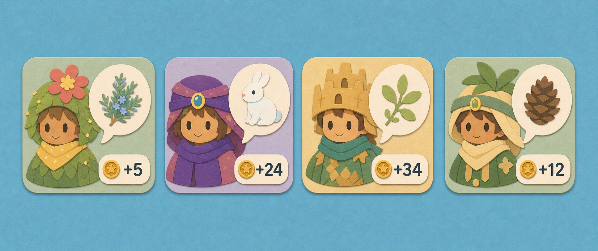
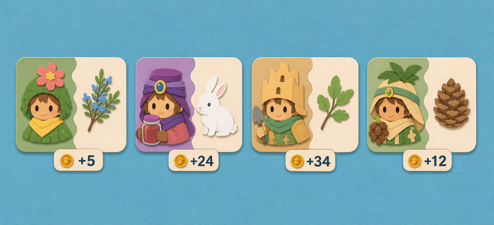
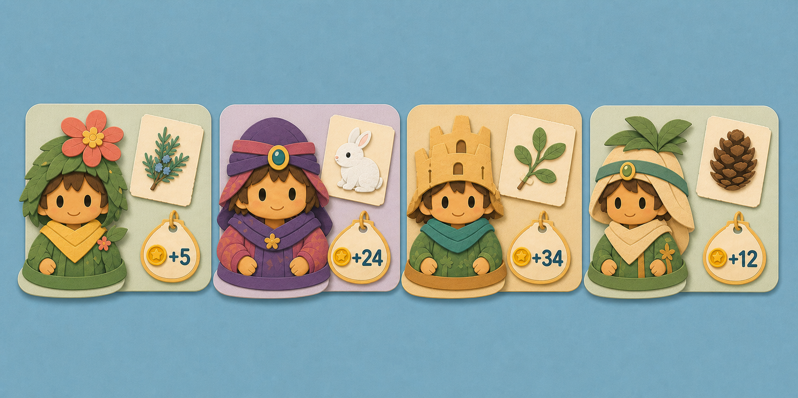

# Board Quest Card Variations v1

Three directly comparable quest-card row concepts for the Grove board. Every
mock uses the same four residents, requested items, reward values, card scale,
and quiet Meadow Sky backdrop. Only the information composition changes.

These are concept images, not runtime assets. Nothing in this folder is wired
into `giver_stand.gd`.

## A — Story Bubble

- Resident fills the left side of a softly tinted card.
- Requested item sits in a large cream speech bubble.
- Reward stays in a compact cream pill inside the card.
- Strongest advantage: quickest to understand and closest to the current live
  mental model.
- Trade-off: the bubble consumes substantial card area.
- Files: `quest_cards_a_story_bubble.png` and
  `quest_cards_a_story_bubble.prompt.txt`.

## B — Split Ticket

- A curved paper seam separates the resident field from the request field.
- Requested item receives a large, quiet cream area with no bubble.
- Reward hangs below the card as a compact tab.
- Strongest advantage: clearest separation between who asks and what they ask
  for.
- Trade-off: the strict two-field structure feels more systematic and less
  characterful.
- Files: `quest_cards_b_split_ticket.png` and
  `quest_cards_b_split_ticket.prompt.txt`.

## C — Layered Postcard

- Resident is an overlapping foreground paper layer at the lower-left edge.
- Requested item sits on a separate, slightly rotated cream note.
- Reward uses a gold-edged hanging seed tag.
- Strongest advantage: most playful and most visibly made from layered paper.
- Trade-off: overlapping pieces need careful spacing in the horizontal quest
  scroller.
- Files: `quest_cards_c_layered_postcard.png` and
  `quest_cards_c_layered_postcard.prompt.txt`.

## Shared content order

1. Flower-crowned forest child — blue-green herb — `+5`.
2. Purple-cloaked child — white winter rabbit — `+24`.
3. Sandcastle-crowned child — green sprig — `+34`.
4. Leaf-hooded child — pine cone — `+12`.

## Recommendation

Start implementation exploration from **A — Story Bubble** if continuity and
immediate readability matter most. Choose **C — Layered Postcard** if the goal
is to push the Cut-Paper Playground identity further. **B — Split Ticket** is
the most orderly and scalable option when quests later need denser content.
