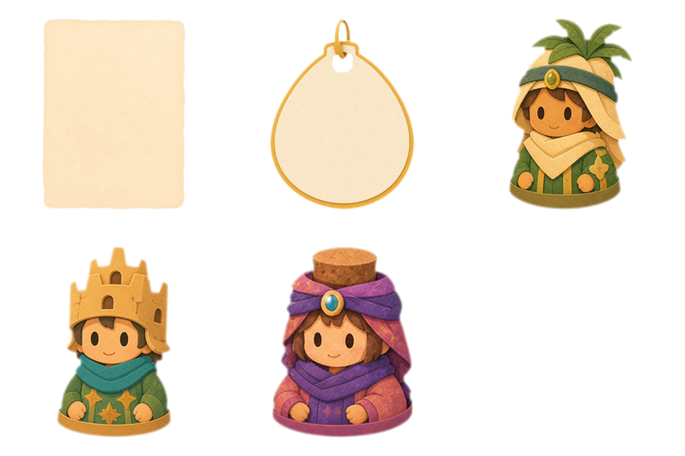

# Layered Postcard Quest Card Assets v1

This bundle contains the new bitmap pieces needed to reconstruct the approved
Layered Postcard quest-card direction. It intentionally does not replace the
live quest-card code in this pass.

## What is authored

- One empty cream request-note sprite, in 512 x 576 master and 256 x 288
  runtime sizes.
- One empty seed-shaped reward tag, in 512 x 512 master and 256 x 256 runtime
  sizes. Its punched hole is transparent.
- Three 256 x 256 resident portrait variants with quest props removed:
  leaf hood without the acorn cluster, sandcastle without shovel or shield,
  and purple hood without the jar.
- One transparent 3 x 2 review sheet. The sixth cell is intentionally empty.

The existing flower resident (`giver_m2_0.png`) already has clean hands and is
reused rather than duplicated.

## What remains dynamic

The base card is a code-drawn rounded paper panel. Its tint and grain tile,
resident choice, requested item, reward coin, reward number, readiness state,
request-note rotation, and shadows remain runtime-controlled. Do not bake those
elements into these sprites.

Use `layout.json` as the composition contract. It records the 160 x 145 logical
card, overflowing portrait rectangle, note and tag rectangles, dynamic content
safe areas, pivots, rotation range, and layer order.

## Trim-before-fit contract

Treat every `source_region` in `layout.json` as the alpha bounding box in the
runtime texture. First trim logically to that region, then aspect-preserving
contain the trimmed region inside the unchanged destination `rect`. Center the
note and tag in their destination rectangles; bottom-center each portrait so
its visible base reaches the authored bottom edge.

| Asset | Runtime texture | Alpha bbox | Source region | Alignment |
|---|---|---|---|---|
| Request note | `final/quest_request_note_256x288.png` | `[29, 12, 227, 275]` | `x=29, y=12, w=198, h=263` | center |
| Reward tag | `final/quest_reward_seed_tag_256.png` | `[39, 11, 216, 245]` | `x=39, y=11, w=177, h=234` | center |
| Leaf-hood portrait | `final/giver_m2_1_clean_256.png` | `[50, 9, 205, 247]` | `x=50, y=9, w=155, h=238` | bottom-center |
| Sandcastle portrait | `final/giver_m2_2_clean_256.png` | `[56, 9, 200, 247]` | `x=56, y=9, w=144, h=238` | bottom-center |
| Purple-hood portrait | `final/giver_m2_3_clean_256.png` | `[40, 9, 216, 247]` | `x=40, y=9, w=176, h=238` | bottom-center |

Fitting the raw full-canvas texture is wrong: its transparent gutters become
part of the fit calculation, shrinking and shifting the visible artwork. That
breaks the note/tag safe-area contract and prevents portrait bases from
reaching the intended `y=154` bottom, nine pixels beyond the card.

## Source and processing

Every accepted raw image and exact built-in image-generation prompt is retained
under `raw/` and `prompts/`. The untouched built-in renders also remain under
`raw/generated_sources/`; the accepted raws normalize their slightly varied
generated fields to exact flat keys. Raw sources use `#FF00FF` except the
legitimate-purple resident, which uses `#00FF00` so its colors survive despill.

The transparent finals were built with the installed imagegen chroma-key helper
using corner sampling, soft matte, thresholds 12 and 220, despill, and one-pixel
edge contraction. They were resized with premultiplied-alpha Lanczos, received
one additional color-blind edge erosion, and had RGB zeroed wherever alpha is
zero. Exact processing settings and measured results are in `qc_report.json`.

## Integration notes

- Apply the trim-before-fit contract above; do not fit transparent full-canvas
  texture bounds directly into the destination rectangles.
- Preserve aspect ratio for every sprite.
- Do not clip the portrait to the card; its authored rounded base overlaps the
  lower-left card edge.
- Apply shadows at runtime. The irregular reward tag needs an alpha-silhouette
  shadow, not a rectangular panel shadow.
- Render request items with the existing `PieceView.make_piece(...)` path and
  reward values as live content.
- Do not reuse the legacy speech bubble, stitched quest card, wooden plaque,
  circular reward token, or shop ribbon for this composition.

This folder is a reviewed concept handoff. A later task should wire the bundle
into `giver_stand.gd` and validate it at the real board-card size.
